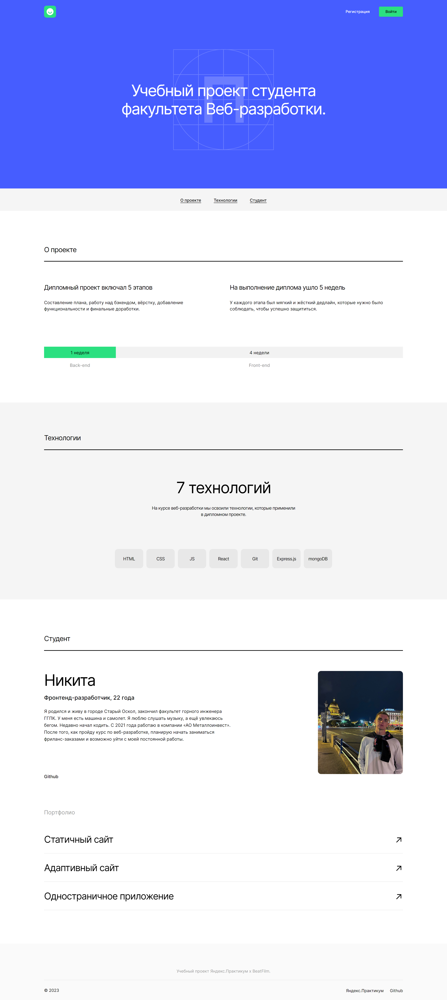
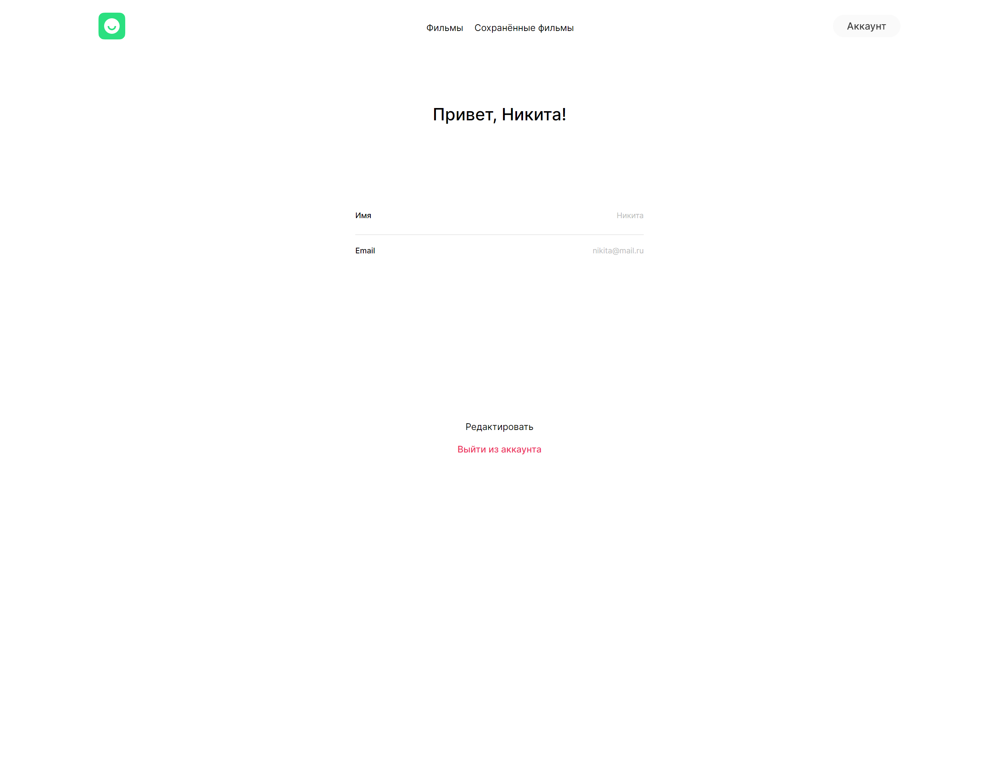
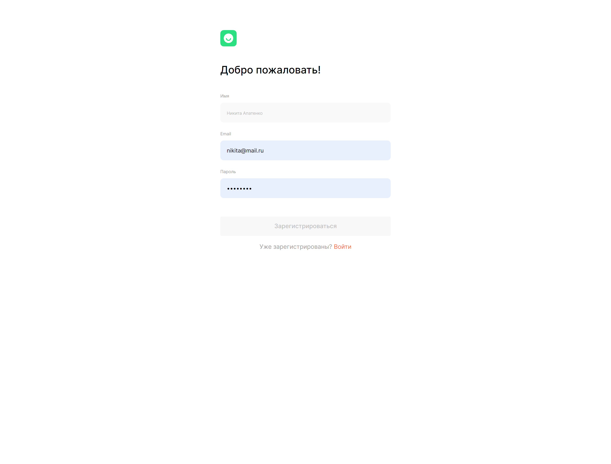

# Дипломный проект Movies Explorer
### *Учебный проект от [Яндекс.Практикум](https://practicum.yandex.ru/web/)*

## Описание проекта
Movies Explorer - это интерактивная SPA-страница, на которой пользователи могут искать фильмы по ключевым словам и добавлять их в избранное в личном кабинете. 

## Функционал:
- Авторизация и регистрация пользователей;
- Редактирование профиля;
- Поиск фильмов по ключевым словам;
- Поиск фильмов по длительности.

## Стек технологий:
- HTML5;
- CSS3:
  - Flexbox;
  - Grid Layout;
  - Positioning;
  - Adaptive UI;
  - Media Queries;
- Методология БЭМ;
- JavaScript:
  - Стиль CamelCase;
  - Промисы (Promise);
  - Асинхронность и оптимизация;
  - Rest API;
- Webpack;
- React JS:
  - Create React App;
  - Портирование разметки в JSX;
  - Функциональные компоненты;
  - Хуки.

## Установка и запуск проекта:
Клонировать репозиторий:

    git clone https://github.com/Beinyc/movies-search-web_site.git

Установить зависимости  в обоих папках:

    npm i

Запустить сервер в папке backend выполнить команду:

    npm run build

Запустить фронтенд часть в папке frontend:

    npm run dev

## Языки:
- JavaScript

## Библиотеки:
- ReactJS

## Чеклист Дипломной работы:
- [Критерии диплома веб-разработчика](https://code.s3.yandex.net/web-developer/static/new-program/web-diploma-criteria-2.0/index.html#js)

## Скриншоты:

<b>Развернуть</b>

# Ссылки:
- [Макет Дипломной работы в Figma](https://www.figma.com/file/6FMWkB94wE7KTkcCgUXtnC/%D0%94%D0%B8%D0%BF%D0%BB%D0%BE%D0%BC%D0%BD%D1%8B%D0%B9-%D0%BF%D1%80%D0%BE%D0%B5%D0%BA%D1%82?type=design&node-id=1-298&mode=design)
- Website: https://nikita-movie.nomoredomainsicu.ru/